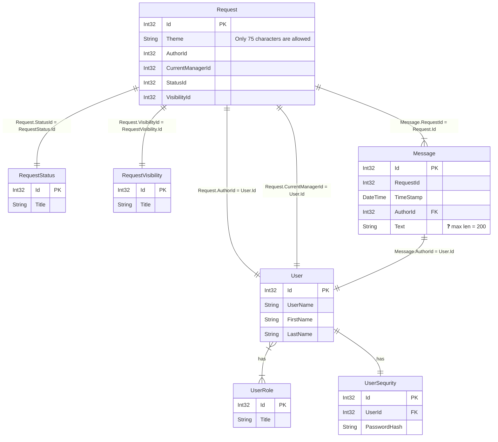
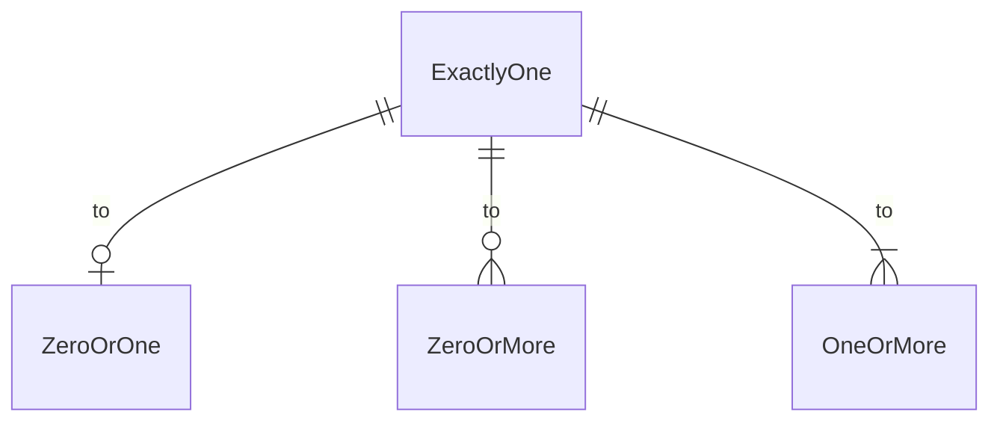

# Support database relational schema

**RequestStatus content:**
| Id | Title |
| ---: | --- |
| 1 | New |
| 10 | InProgress |
| 20 | Finished |
| 21 | Canceled |
| 22 | Aborted |

**RequestVisibility content:**
| Id | Title |
| ---: | --- |
| 1 | Public |
| 10 | Private |
---

# Draft of requirements for Support app

1. Authentication    
  1.1. Type??? OAuth???  
  1.2. No password recovery  
  1.3. Auth flow (registration, login, logout)  
  1.4. Password recovery? :question: Maybe...  
  1.5. Password validation: NIST (8+, upper, lower, num, special char)    
2. Roles: [User, Manager, Admin(God?)]  
3. Users  
  3.1. Username is unique? :heavy_check_mark: YES  
  3.2. How do we define the role?  
  3.3. Do we need a profile? :heavy_check_mark: YES  
  3.4. Completely remove? :heavy_check_mark: YES (GDPR). By pressing the button...  
  3.5. Should we remove a Request if the user is removed? :x: NO!  
4. Messages:  
  4.1. Do we store the history? :heavy_check_mark: YES  
  4.2. Should we mark the read status? :x: NO!  
  4.3. Max len = 200
5. Integrations. :x: NO integrations!  
6. Managers:  
  6.1. Could we transfer the Request to another manager? :question: Maybe ...  
  6.2. Reviews? :x: NO  
  6.3. We can change the status to `Not started`. Unassign manager.  
7. Requests:  
  7.1. Do we have categories? :question: Maybe...  
  7.2. Search through requests? :heavy_check_mark: YES  
  7.3. Similar requests search? :heavy_check_mark: YES (by title)  
  7.4. On creation user define the visibility: [Public/Private]
  7.5. Could anonymous see the public requests? :heavy_check_mark: YES  
  7.6. Removal is not allowed?  
  7.7. Do we have any text validation? Header max len = 75. Content is not limited

---

[About Mermaid entity relationship diagrams](https://mermaid.js.org/syntax/entityRelationshipDiagram.html)

Conventions of relationships between entities:

