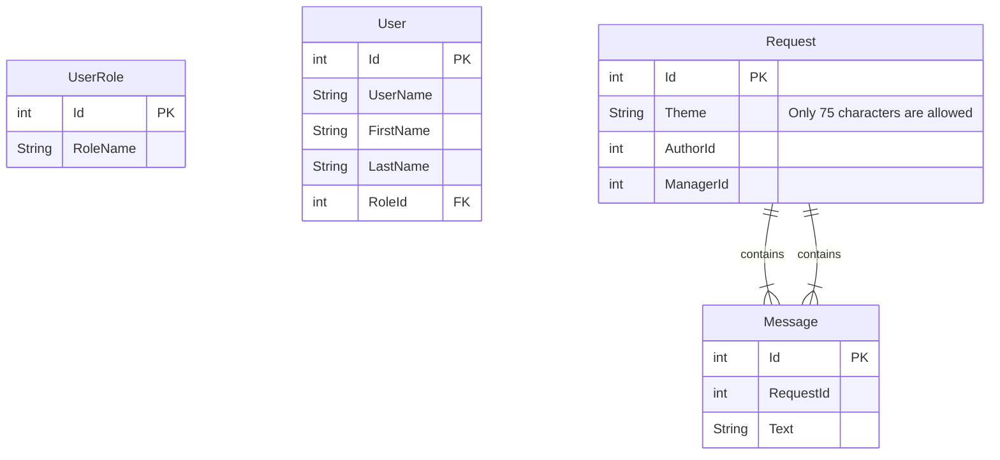
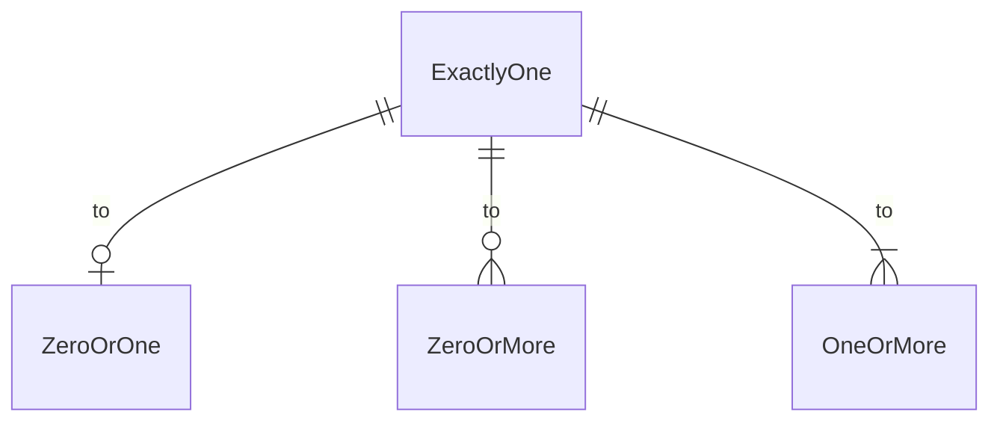

1. Authentication
  
  1.1. Type??? OAuth???  
  1.2. No password recovery  
  1.3. Auth flow (registration, login, logout)  
  1.4. Password recovery? Maybe...  
  1.5. Password valodation: NIST (8+, upper, lower, num, special char)
  
2. Roles: [User, Manager, Admin(God?)]

3. Users
  3.1. Username is unique? :heavy_check_mark:

# Support database relational schema

---

[About Mermaid entity relationship diagrams](https://mermaid.js.org/syntax/entityRelationshipDiagram.html)

Conventions of relationships between entities:

