# Social network database relational schema

```mermaid
erDiagram

  User {
    Int32 Id PK
    String UserName    
  }
  
  Profile {
    Int32 Id PK
    Int32 UserId FK
    Int32 Sex "0 - female; 1 - male"
    String FirstName
    String LastName
    String MiddleName
    DateTime DateOfBirth
    String About
  }
  
  Post {
    Int32 Id PK
    Int32 UserId FK
    DateTime TimeStamp
    String Text
  }
  
  Comment {
    Int32 Id PK
    Int32 UserId FK
    Int32 PostId FK    
    DateTime TimeStamp
    String Text
  }
  
  Like {
    Int32 Id PK
    Int32 UserId FK
    Int32 ItemId FK
    Int32 ItemType "0 - Post table; 1 - Comment table"
    Int32 Value "0 - 👎; 1 - 👍"
  }
  
  Profile ||--|| User : "Profile.UserId = User.Id"
  User ||--|{ Post : "Post.UserId = User.Id"
  User ||--|{ Comment : "Comment.UserId = User.Id"
  Post ||--|{ Comment : "Comment.PostId = Post.Id"
  Like }|--|| User : "Like.UserId = User.Id"
  Like }|--|| Post : "Like.ItemId = Post.Id, Like.ItemType = 0"
  Like }|--|| Comment : "Like.ItemId = Post.Id, Like.ItemType = 1"
```  

  

[About Mermaid entity relationship diagrams](https://mermaid.js.org/syntax/entityRelationshipDiagram.html)

Conventions of relationships between entities:

